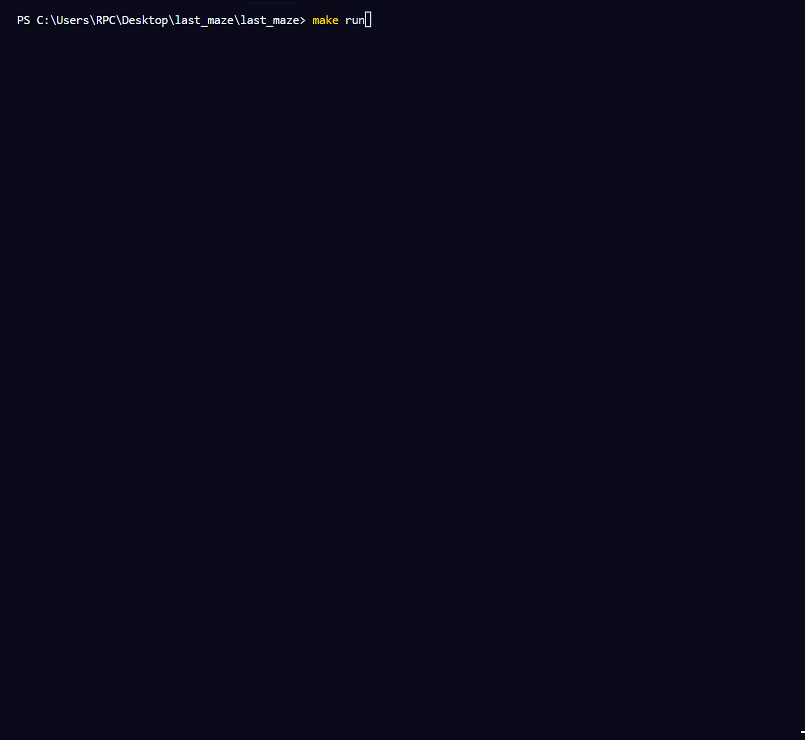
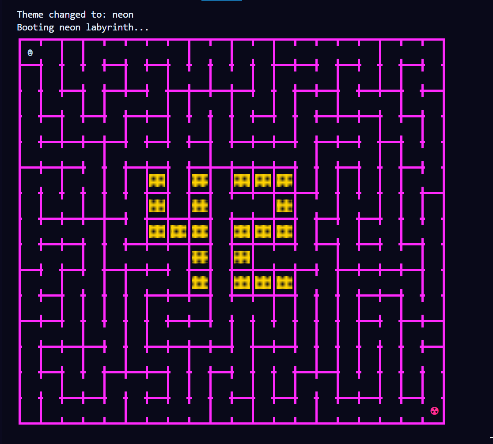
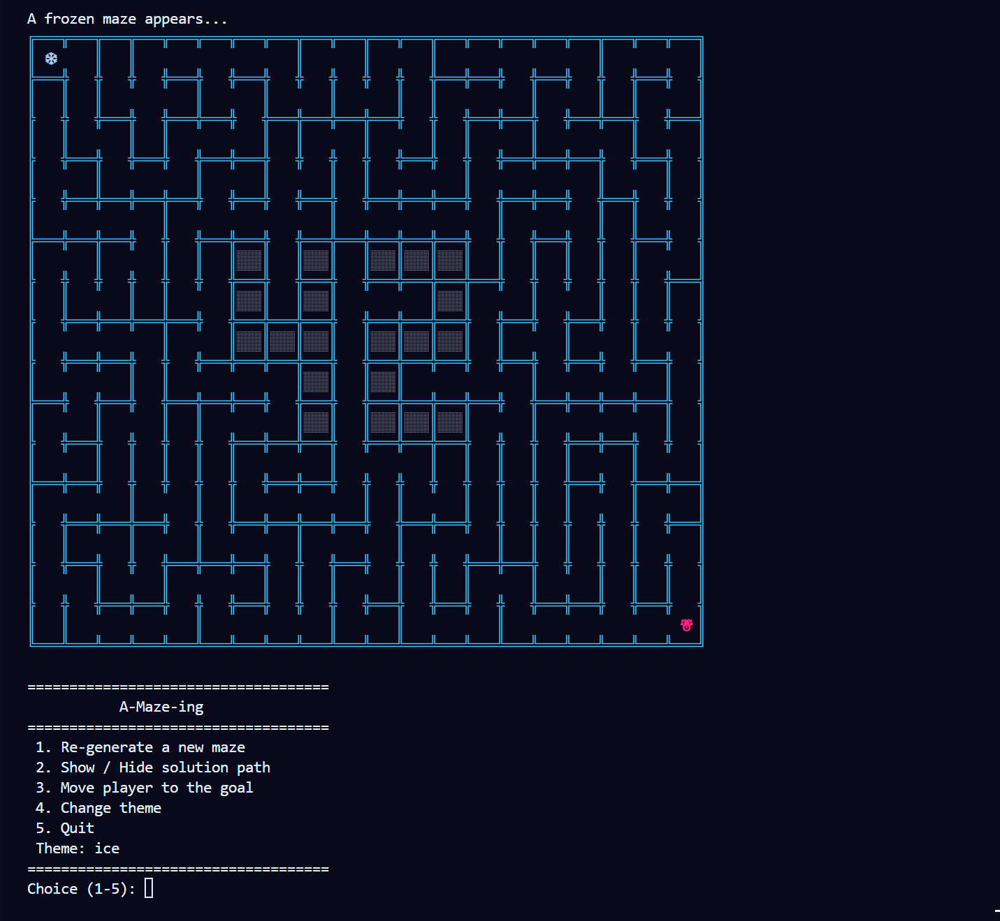

*This project has been created as part of the 42 curriculum by msellami, mel-hyna.*

# A-Maze-ing

A Python project that generates, solves, displays, and exports mazes in hexadecimal format.

---

## Demo

### Maze generation


### Player movement


### Theme switching


---
## Interactive Demos

You can also explore the project through interactive HTML demos:

- [DFS maze generation](demos/dfs_maze_generation_interactive.html)
- [BFS maze solver with 42 pattern](demos/small_maze_bfs_42pattern.html)

---

## Description

A-Maze-ing is a Python project that generates a maze from a configuration file and exports it in a **hexadecimal format**.

The program builds a valid maze structure — optionally a **perfect maze** — and guarantees:

- A valid entry and exit point
- A shortest path between them
- A visible **"42" pattern** embedded in the grid (when the maze is large enough)
- A terminal-based visual representation with theme support

The project is designed with **modularity and reusability** in mind, exposing its core logic as an importable Python module (`mazegen`).

---
## Assets

Visual assets used in this repository are stored in the `assets/` folder:

- `assets/maz_demo.gif` — maze generation preview
- `assets/mov_player.gif` — player movement animation
- `assets/change_theme.gif` — theme switching preview

---
## Instructions

### Requirements

Make sure Python 3.10 or later is installed:

```bash
python3 --version
```

### Installation

Clone the repository and install dependencies:

```bash
git clone https://github.com/your_login/a-maze-ing.git
cd a-maze-ing
make install
```

The `make install` command runs:

```bash
pip3 install -r requirements.txt
pip3 install .
```

### Execution / compilation

Run the program by passing a configuration file as argument:

```bash
python3 a_maze_ing.py config.txt
```

### Makefile rules

| Rule | Description |
|------|-------------|
| `make install` | Install dependencies from `requirements.txt` and the `mazegen` package |
| `make run` | Run `a_maze_ing.py` with `config.txt` |
| `make debug` | Run `a_maze_ing.py` in debug mode via `pdb` |
| `make clean` | Remove `__pycache__`, `.mypy_cache`, and `*.pyc` files |
| `make lint` | Run `flake8` and `mypy` with standard flags |

---

## Configuration File Format

Each line must follow the `KEY=VALUE` format.
Lines starting with `#` are treated as comments and ignored.

### Required keys

| Key           | Example              | Description                                                  |
|---------------|----------------------|--------------------------------------------------------------|
| `WIDTH`       | `20`                 | Number of columns in the maze (min: 3, max: 50)              |
| `HEIGHT`      | `15`                 | Number of rows in the maze (min: 3, max: 50)                 |
| `ENTRY`       | `0,0`                | Entry cell coordinates as `col,row`, inside grid bounds      |
| `EXIT`        | `19,14`              | Exit cell coordinates as `col,row`, inside grid bounds       |
| `OUTPUT_FILE` | `maze.txt`           | Plain filename (with extension) where the maze will be saved |
| `PERFECT`     | `true`               | `true`/`false` — whether the maze has exactly one path       |

### Optional keys

| Key       | Default    | Example   | Description                                                       |
|-----------|------------|-----------|-------------------------------------------------------------------|
| `SEED`    | `None`       | `42`      | Integer seed for reproducible generation; any string is hashed   |
| `ANIMATE` | `false`    | `true`    | Enable animated generation rendering in the terminal              |
| `THEME`   | `dungeon`  | `ice`     | Visual theme: `dungeon`, `ice`, `neon`, `forest`                  |

### Validation rules

- `WIDTH` and `HEIGHT` must be between 3 and 50
- `ENTRY` and `EXIT` must be inside the grid and must be different cells
- `ENTRY` and `EXIT` cannot overlap the **42 pattern**
- `OUTPUT_FILE` must be a plain filename with an extension (no path separators), and cannot conflict with existing project files
- `PERFECT` and `ANIMATE` accept: `true`/`false`, `1`/`0`, `yes`/`no`
- `THEME` must be one of: `dungeon`, `ice`, `neon`, `forest`
- If `WIDTH` < 7 or `HEIGHT` < 9, the 42 pattern is skipped and an error message is printed

### Example config file

```
# A-Maze-ing configuration
WIDTH=20
HEIGHT=15
ENTRY=0,0
EXIT=19,14
OUTPUT_FILE=maze.txt
PERFECT=true
SEED=42
ANIMATE=false
THEME=dungeon
```

---

## Maze Generation Algorithm

The maze is generated using the **Depth-First Search (DFS)** algorithm with iterative backtracking (implemented in `mazegen/mazegenerator.py`, method `_dfs_generate`).

### Why DFS?

- Simple and straightforward to implement
- Naturally produces **perfect mazes** — exactly one path between any two cells
- Guarantees full connectivity — every non-forbidden cell is reachable
- Produces long, winding corridors that create a satisfying maze experience
- Efficient at any grid size within the supported bounds

When `PERFECT=false`, extra wall openings are added after DFS to create loops (method `_add_extra_openings`), with a 15% probability per eligible wall.

The maze is **solved using BFS** (Breadth-First Search) to guarantee the shortest path between entry and exit (`_solve_maze`).

---

## Output File Format

Each cell is encoded as one **hexadecimal digit** representing its closed walls using 4 bits:

| Bit     | Direction | Value if closed |
|---------|-----------|-----------------|
| 0 (LSB) | North     | 1               |
| 1       | East      | 2               |
| 2       | South     | 4               |
| 3       | West      | 8               |

A closed wall sets the bit to `1`; open means `0`.

Examples:
- `3` (binary `0011`) → North + East walls closed
- `A` (binary `1010`) → East + West walls closed
- `F` (binary `1111`) → all walls closed (42 pattern cell)

Cells are written row by row, one row per line. After an empty line, the file contains three additional lines:

1. Entry coordinates (e.g. `0,0`)
2. Exit coordinates (e.g. `19,14`)
3. Shortest path as a sequence of `N`, `E`, `S`, `W` characters

All lines end with `\n`.

---

## Visual Representation

The maze is rendered directly in the terminal using Unicode box-drawing characters and ANSI colours.

### Interactive menu (options 1–5)

| Choice | Action |
|--------|--------|
| `1` | Re-generate a new maze (new random seed) |
| `2` | Show / Hide the shortest solution path |
| `3` | Animate the player walking to the goal step by step |
| `4` | Cycle to the next visual theme |
| `5` | Quit |

### Themes

| Theme     | Wall colour | Path colour | Description            |
|-----------|-------------|-------------|------------------------|
| `dungeon` | White       | Yellow      | Classic ASCII dungeon  |
| `ice`     | Cyan        | White       | Frozen cave style      |
| `neon`    | Magenta     | Cyan        | Neon glow style        |
| `forest`  | Green       | Yellow      | Forest path style      |

---

## 42 Pattern

A **"42" pattern** is stamped into the maze as fully closed cells before generation begins. These cells are treated as forbidden during DFS — they are never visited and never opened.

- Pattern size: 7 columns × 5 rows
- Automatically centred in the grid
- Requires at least `WIDTH=7` and `HEIGHT=9` to be drawn
- If the maze is too small, an error message is printed and generation continues without the pattern
- `ENTRY` and `EXIT` cannot overlap any cell of the pattern (validated at config parse time)

---

## Code Reusability

The maze generation logic is packaged as a standalone, installable module: `mazegen`.

### Installation from the wheel

```bash
pip install mazegen-1.0.0-py3-none-any.whl
```

### Rebuild the package from source

```bash
pip install build
python -m build
# Output: dist/mazegen-1.0.0-py3-none-any.whl
```

### Basic usage

```python
from mazegen import MazeGenerator

# Instantiate with custom dimensions and an optional seed
maze = MazeGenerator(width=20, height=15, seed=42)

# Generate the maze
# Returns:
#   grid      — 2D list of Cell objects (Cell has .north/.east/.south/.west booleans)
#   path      — string of directions 'N', 'E', 'S', 'W' for the shortest path
#   forbidden — set of (col, row) tuples representing the '42' pattern cells
grid, path, forbidden = maze.generate()

# Access a specific cell
cell = grid[row][col]
print(cell.north)   # True = wall closed, False = wall open

# Print the shortest path
print("Shortest path:", path)

# Write the output file
maze.write_output("maze.txt", grid, path)
```

### Constructor parameters

| Parameter | Type         | Default               | Description                                           |
|-----------|--------------|-----------------------|-------------------------------------------------------|
| `width`   | `int`        | required              | Number of columns                                     |
| `height`  | `int`        | required              | Number of rows                                        |
| `seed`    | `int\|None`  | `None`                | Optional seed for reproducible generation             |
| `perfect` | `bool`       | `True`                | If `True`, generates a perfect maze (one unique path) |
| `entry`   | `Coord`      | `(0, 0)`              | Entry cell as `(col, row)`                            |
| `exit_`   | `Coord`      | `(width-1, height-1)` | Exit cell as `(col, row)`                             |

> Note: The internal grid uses `Cell` objects, not the hex integer format of the output file.

---

## Team & Project Management

### Roles

| Member     | Responsibilities                                                        |
|------------|-------------------------------------------------------------------------|
| **Manar**  | Maze generation algorithm (DFS + backtracking, grid logic, BFS solver)  |
| **Meryem** | Configuration file parsing, validation, and error handling              |

### Planning

**Initial plan:**

1. Phase 1 — Config parser + grid structure
2. Phase 2 — Maze generation algorithm (DFS + backtracking)
3. Phase 3 — Output formatting + terminal visualization

**How it evolved:**

The initial phasing held up well. The main adjustment was spending more time than expected on the 42 pattern placement — ensuring it never conflicted with the entry/exit or the DFS traversal required extra constraint logic in both the config validator and the generator. Visualization and theming were added last and extended the timeline slightly.

### What worked well

- Clear separation of concerns between parsing (`config_parser.py`) and generation (`mazegenerator.py`) made debugging easier
- Modular architecture allowed both members to work in parallel without merge conflicts
- Using a fixed seed made testing fully reproducible from the start

### What could be improved

- The animation system could be more robust and frame-rate controlled
- Supporting multiple generation algorithms (Prim's, Kruskal's) would make the project more flexible

### Tools used

- **Python 3.10+** — core language
- **Git / GitHub** — version control and collaboration
- **flake8** — code style linting (PEP 8)
- **mypy** — static type checking
- **Terminal** — development, testing, and visualization

---

## Bonus Features

- **Animated intro screen** displayed on program launch (`intro_animation.py`)
- **Player movement simulation** — option 3 animates a player walking through the maze step by step
- **Theme system** with 4 distinct visual styles, cycled at runtime
- **Configurable randomness** via seed for fully reproducible mazes
- **Non-perfect maze support** — extra wall openings create loops when `PERFECT=false`

---

## Resources

- [Maze generation algorithms — Wikipedia](https://en.wikipedia.org/wiki/Maze_generation_algorithm)
- [Depth-First Search — Wikipedia](https://en.wikipedia.org/wiki/Depth-first_search)
- [Breadth-First Search — Wikipedia](https://en.wikipedia.org/wiki/Breadth-first_search)
- [Python 3 official documentation](https://docs.python.org/3/)
- [Jamis Buck's Maze Algorithms blog](https://weblog.jamisbuck.org/2011/2/7/maze-generation-algorithm-recap)

### AI Usage

AI (chatgpt) was used for the following tasks on specific parts of the project:

- **Understanding project requirements** 
- **Debugging** 

AI was used strictly as a support tool. All core logic, design decisions, algorithm choices.